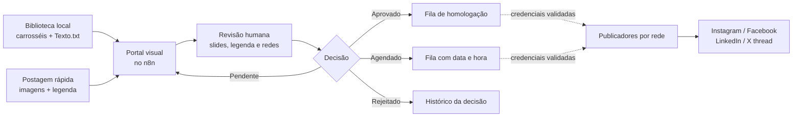

# Postagem Redes

Portal visual de curadoria, aprovação e preparação multicanal de conteúdo, construído no **n8n** para operações de marketing técnico B2B.

O projeto transforma uma biblioteca local de carrosséis em uma fila clara de revisão: a pessoa responsável vê os slides, edita a legenda, escolhe as redes, aprova, agenda ou rejeita. Também pode criar uma postagem rápida enviando imagens e texto diretamente pelo navegador. A publicação externa fica separada da aprovação e só é conectada depois da homologação de cada conta.

> **Versão de portfólio.** Os workflows publicados aqui são sanitizados e inativos: não contêm credenciais, tokens, contas, e-mails reais, imagens corporativas, nem dados de execução.

## Demonstração do fluxo



## O que foi construído

- **Biblioteca visual de conteúdos:** lê pastas locais com imagens e `Texto.txt`, reconhece carrosséis e apresenta cada item em cards pesquisáveis.
- **Editor visual de carrossel:** exibe todos os slides, permite navegar por botões ou teclado, trocar título/legenda, acompanhar a contagem de caracteres, selecionar redes, definir responsável, comentar a decisão e escolher pendente, aprovado, agendado ou rejeitado.
- **Ordem controlada de slides:** a pessoa ajusta a sequência antes do envio e pode reorganizar um carrossel já existente; a ordem é persistida na biblioteca e auditada.
- **Postagem rápida em uma única tela:** o responsável arrasta ou escolhe de 1 a 10 imagens, vê a prévia, remove arquivos, define a ordem, escreve a legenda e envia para aprovação sem criar pasta ou editar planilha.
- **Rastreabilidade operacional:** cada decisão grava operador, data, comentário, redes escolhidas e estado em um ledger local com escrita atômica.
- **Separação segura de responsabilidades:** aprovação organiza a fila; nenhum clique no portal publica externamente enquanto as credenciais não forem validadas.
- **Compatibilidade com o legado:** os workflows históricos de geração por Google Drive/Sheets, IA, retry e alerta de erro permanecem exportados para estudo e evolução, sem acoplamento obrigatório ao portal.

## Arquitetura

| Camada | Responsabilidade | Implementação |
|---|---|---|
| Biblioteca | Descobrir carrosséis e legenda | Pastas locais persistentes montadas no container Docker |
| Portal | Exibir, filtrar e receber decisões | Webhook `GET` do n8n que entrega uma interface HTML responsiva |
| Arquivos | Servir somente os slides pertencentes ao item | Webhook `GET` com validação de identificador e nome de arquivo |
| Ações | Gravar aprovação e receber envio rápido | Webhook `POST` com validação de dados e arquivo |
| Estado | Manter status e auditoria | JSON local com arquivo temporário + lock de escrita |
| Publicadores | Enviar para as redes após homologação | Evolução dos workflows de integração por plataforma |

Os três novos exports do portal são complementares aos três workflows legados:

| Workflow | Papel |
|---|---|
| `04-portal-visual.sanitized.json` | Entrega o painel de aprovação e a biblioteca de conteúdo. |
| `05-portal-acoes.sanitized.json` | Recebe decisões e postagens rápidas, valida e registra o histórico. |
| `06-portal-arquivos.sanitized.json` | Serve imagens de forma restrita para a prévia visual. |
| `01` a `03` | Preservam a arquitetura legada de orquestração, alertas e retentativas. |

## Jornada de uso

1. Coloque um novo carrossel em uma subpasta da biblioteca, com imagens PNG/JPG/WEBP e `Texto.txt`; ou use **Criar publicação** no portal.
2. Abra o atalho corporativo do portal, pesquise o conteúdo e clique em **Abrir editor**.
3. Navegue pelos slides, ajuste a legenda, selecione as redes e informe o responsável.
4. Aprove imediatamente, agende ou rejeite com um comentário.
5. Quando todas as contas estiverem homologadas, o publicador usará somente os itens aprovados/agendados e gravará o ID/permalink por rede.

Consulte o guia detalhado em [docs/portal.md](docs/portal.md).

## Estado atual e segurança

O portal está pronto para operação de **homologação**: organiza conteúdo e registra decisões, mas não aciona Instagram, Facebook, LinkedIn ou X. Isto evita publicação indevida enquanto OAuth, permissões e limites de cada conta ainda são verificados.

Foi escolhido acesso sem login para facilitar o uso em computadores autorizados da rede local. Consequentemente, qualquer dispositivo que alcance a URL do portal pode alterar a fila. A mitigação atual é o registro obrigatório do operador; antes de expor além da LAN, implemente autenticação, HTTPS e controle de acesso de rede. Veja [docs/security.md](docs/security.md).

## Como validar os exports

```powershell
node scripts/build-portal-workflows.mjs
node scripts/validate-portal-code.mjs
pwsh -File scripts/validate-workflows.ps1
```

O GitHub Actions executa validação de JSON, garante que os exports permaneçam inativos, rejeita blocos de credenciais e impede e-mails reais no material de portfólio.

## Atalho Windows com ícone próprio

O projeto inclui um instalador de atalho `.lnk` com ícone próprio, sem depender do ícone genérico de atalhos de internet:

```powershell
pwsh -File scripts/install-postagem-redes-shortcut.ps1 -PortalUrl 'http://<servidor-n8n>:5678/webhook/postagem-redes'
```

O script cria o ícone em `%LOCALAPPDATA%\Vesper\PostagemRedes` e adiciona **Postagem Redes.lnk** à Área de Trabalho do usuário atual. Em cada computador da empresa, execute o mesmo comando apontando para o servidor n8n interno.

## Documentação

- [Portal e operação diária](docs/portal.md)
- [Arquitetura](docs/architecture.md)
- [Configuração e credenciais](docs/setup.md)
- [Segurança](docs/security.md)
- [Plano de testes](docs/testing.md)
- [Notas de migração](docs/migration.md)

## Tecnologias

`n8n` · `Docker` · `JavaScript` · `Node.js` · `Webhooks` · `Google Drive` · `Google Sheets` · `Gemini` · `OpenAI` · `Ollama` · `Meta Graph API` · `LinkedIn API` · `X API` · `SMTP`

## Autor

Desenvolvido por [Maycon Xavier](https://github.com/Mayconxzdev) como projeto de automação de conteúdo, interface operacional e publicação multicanal.
