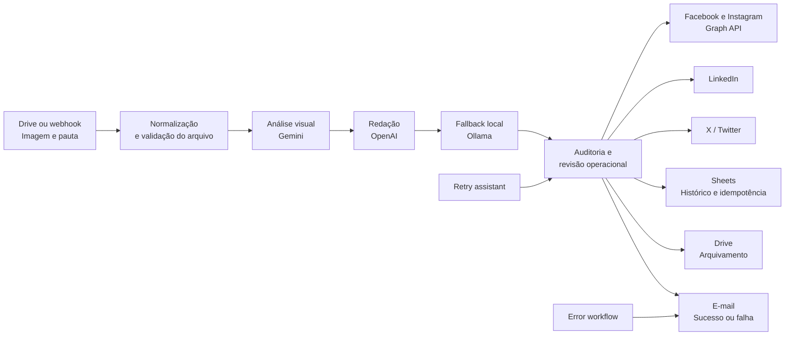

# Postagem Redes

Automação de conteúdo e publicação multicanal construída no n8n para transformar imagens e pautas técnicas em posts prontos para revisão, publicação e rastreabilidade.

O projeto nasceu para uma operação industrial B2B: recebe imagens e temas, analisa contexto visual, produz uma redação ajustada ao canal, controla histórico de uso e organiza a publicação em redes sociais. A implementação combina n8n, Google Drive, Google Sheets, modelos de IA, APIs sociais, tratamento de erros e retentativas controladas.

> Este repositório é uma versão de portfólio. Os workflows estão sanitizados: não há tokens, credenciais, IDs de contas, endereços internos ou dados de execução.

## O problema que resolve

Em uma rotina de marketing técnico, produzir conteúdo consistente exige juntar imagem, contexto de produto, linguagem adequada a cada rede e controle para não reaproveitar a mesma pauta. Fazer isso manualmente consome tempo e torna difícil saber o que foi publicado, onde falhou e o que precisa ser retomado.

O fluxo organiza essa operação em uma esteira única:

## Principais capacidades

- Agendamento de geração de conteúdo em horários definidos.
- Recebimento de imagem por Google Drive ou webhook.
- Análise visual com Gemini e fallback por OpenAI/Ollama.
- Geração de texto para conteúdo técnico B2B.
- Registro de histórico e prevenção de repetição com Google Sheets.
- Publicação planejada para Facebook, Instagram Business, LinkedIn e X.
- Arquivamento de imagens processadas no Google Drive.
- Alertas por e-mail para sucesso, falha parcial e erro de workflow.
- Assistente de retry para retomar execuções com falha.
- Estratégia de aprovação documentada antes da publicação em produção.

## Arquitetura dos workflows

| Workflow | Responsabilidade |
|---|---|
| `Postagem Redes — Orquestrador de Conteúdo` | Seleciona imagem, chama IA, prepara conteúdo, registra histórico e coordena as redes. |
| `Postagem Redes — Alerta de Erros` | Recebe erros do n8n e envia um alerta operacional. |
| `Postagem Redes — Assistente de Retry` | Recebe uma solicitação controlada para tentar novamente uma execução falha. |

Os exports sanitizados estão em [`workflows/`](workflows). Eles servem para estudo de arquitetura e revisão técnica; as credenciais devem ser criadas diretamente na instância n8n de destino.

## Estado da migração

- Workflows revisados para o n8n 2.27.x.
- Importação preparada para ocorrer desativada.
- Webhooks renomeados para evitar colisão com outros projetos.
- Arquivo temporário direcionado para volume persistente em `/files/postagem-redes/`.
- Ligação entre orquestrador e workflow de erro recriada após a importação.
- Publicação em redes permanece desativada até a validação manual das contas, credenciais e do mecanismo de aprovação.

## Como executar com segurança

1. Importe os três JSONs sanitizados como workflows desativados.
2. Crie as credenciais indicadas em [`docs/setup.md`](docs/setup.md).
3. Configure a proteção dos webhooks antes de ativá-los.
4. Implemente e valide o mecanismo de aprovação descrito em [`docs/architecture.md`](docs/architecture.md).
5. Rode o plano de teste em [`docs/testing.md`](docs/testing.md) antes de habilitar qualquer publicação.

## Decisões de engenharia

- **Sem credenciais no Git:** tokens e OAuth ficam exclusivamente no cofre de credenciais do n8n.
- **Falha isolada por rede:** uma falha em uma plataforma não deve impedir o registro e a análise das demais.
- **Rastreabilidade antes de automação total:** cada publicação deve registrar data, rede, status, ID e permalink.
- **Aprovação antes da produção:** geração pode ser automática, mas publicação exige validação enquanto as contas são homologadas.
- **Fallback de IA:** a cadeia Gemini → OpenAI → Ollama reduz indisponibilidades em serviços externos.

## Documentação

- [Arquitetura](docs/architecture.md)
- [Configuração e credenciais](docs/setup.md)
- [Segurança](docs/security.md)
- [Plano de testes](docs/testing.md)
- [Notas de migração](docs/migration.md)

## Tecnologias

`n8n` · `Docker` · `Google Drive` · `Google Sheets` · `Gemini` · `OpenAI` · `Ollama` · `Meta Graph API` · `LinkedIn API` · `X API` · `SMTP`

## Autor

Desenvolvido por [Maycon Xavier](https://github.com/Mayconxzdev) como projeto de automação de conteúdo e operação multicanal.
