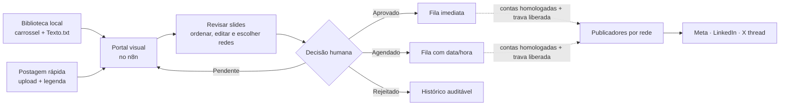

# Postagem Redes

[](https://github.com/Mayconxzdev/PostagemRedes/actions/workflows/validate.yml)

**Projeto autoral de [Mayconxzdev](https://github.com/Mayconxzdev)** para organizar a publicação de conteúdo técnico B2B: uma biblioteca visual de carrosséis, revisão humana, aprovação, agendamento e uma fila protegida para Instagram, Facebook, LinkedIn e X.

O problema não era somente "postar em quatro redes". Era dar a uma pessoa não técnica uma tela para enxergar o carrossel, ajustar a legenda, ordenar slides, registrar quem decidiu e impedir que uma aprovação disparasse uma publicação indevida. O projeto substitui a operação espalhada entre planilha, armazenamento e fluxos difíceis de auditar por uma camada operacional centrada no n8n.

> **Leitura honesta do estado:** os três workflows abaixo existem na instância local n8n e estão ativos para o portal, biblioteca e fila. Os exports deste repositório são sanitizados e **inativos por design**: não carregam tokens, contas, IDs corporativos ou dados de clientes. As chamadas externas permanecem protegidas até a homologação OAuth de cada rede.

## Meu papel

- Desenho do fluxo e da política de aprovação antes de publicação.
- Construção do portal operacional em HTML/CSS/JavaScript dentro do n8n.
- Modelagem da fila, idempotência por destino, ledger, retry e bloqueios de segurança.
- Integração preparada para APIs oficiais de Meta, LinkedIn e X, com IA assistiva que só gera rascunho.
- Sanitização dos exports, documentação de setup e validação contínua no GitHub Actions.

## Interface de operação

<p align="center">
  
</p>

<p align="center">
  
  
</p>

As telas são uma demonstração estática anônima, gerada a partir do template do portal e disponível em [docs/demo/index.html](docs/demo/index.html). Ela permite avaliar o fluxo visual sem expor dados internos ou precisar de acesso à infraestrutura.

## Workflow principal no n8n

O canvas abaixo é o workflow `Portal: Ações` na instância local. Ele reúne a entrada do portal, IA assistiva, fila protegida, rotas de publicação e registro de resultado — sem transformar aprovação em publicação automática.

<p align="center">
  <a href="docs/assets/n8n-real/05-portal-acoes-canvas-completo.png">
    
  </a>
</p>

<p align="center"><sub>Canvas real do n8n · 53 nós · clique para ampliar</sub></p>

| Workflow mantido | Gatilho | Responsabilidade verificável |
|---|---|---|
| `04 · Portal visual` | Webhook `GET` | Lê a biblioteca e entrega a central de revisão, filtros, modais e upload rápido. |
| `05 · Portal: ações` | Webhook `POST` + agenda | Persiste decisões, produz rascunhos com IA, reserva entregas, aplica retry, registra resultado e contém as rotas de publicação. |
| `06 · Portal: arquivos` | Webhook `GET` | Serve somente mídia vinculada ao conteúdo solicitado; valida item/nome e suporta URL assinada quando exposto publicamente. |

Os exports do Git removem credenciais e dados operacionais. As capturas completas dos workflows auxiliares e a origem visual estão em [Evidências técnicas](docs/evidence.md).

## O fluxo de produto



## Capacidades implementadas e limites explícitos

| Camada | Estado no projeto | Observação importante |
|---|---|---|
| Biblioteca visual | Implementada | Identifica carrosséis e `Texto.txt`, monta cards pesquisáveis e apresenta estados. |
| Revisão e aprovação | Implementada | Edita título/legenda, destinos, ordem dos slides, decisão, responsável e comentário. |
| Postagem rápida | Implementada | Aceita 1 a 10 PNG/JPG/JPEG/WEBP, com prévia e reordenação antes de entrar como pendente. |
| IA assistiva | Implementada e desligada por variável | OpenAI → Gemini → Ollama gera **rascunho**; nunca altera a legenda sem confirmação humana. |
| Fila e auditoria | Implementada | Reserva por destino, `dispatchId`, ledger em Data Table e tentativa controlada por entrega. |
| Publicadores sociais | Implementados e bloqueados até homologação | Rotas para Instagram carrossel, Facebook multi-foto, LinkedIn de Página e X com mídia/thread. Não há alegação de publicação externa concluída neste repositório. |
| Acesso externo | Fora do escopo do portfólio | A operação atual é de rede local. HTTPS, autenticação e restrição de origem são pré-requisitos para exposição pública. |

Essa separação é intencional: **aprovar não publica**. A publicação só é elegível quando a conta foi homologada, a mídia atende os pré-requisitos da rede e a variável global `SOCIAL_PUBLISH_ENABLED` foi liberada.

## Decisões de engenharia

- **Três workflows, não um monólito:** renderização, ações e mídia isoladas reduzem acoplamento e tornam os erros localizáveis.
- **Fonte de verdade local:** biblioteca e estado do conteúdo não dependem de Google Sheets para a operação diária.
- **Idempotência e reserva:** cada destino recebe uma chave de entrega antes da chamada externa, evitando duplicação após retry.
- **APIs por rede:** onde um nó nativo não cobre o caso (carrossel/multiimagem/mídia), o fluxo usa HTTP Request com contrato explícito, em vez de fingir suporte incompleto.
- **IA com queda controlada:** OpenAI é o primeiro provedor; Gemini e Ollama só entram quando habilitados. Todas as respostas viram rascunho revisável.
- **Segredos fora do Git:** tokens e OAuth pertencem ao cofre criptografado de credenciais do n8n, nunca a Code nodes, exports ou documentação.

## Como valido o projeto

```powershell
node scripts/build-portal-workflows.mjs
node scripts/build-portfolio-demo.mjs
node scripts/validate-portal-code.mjs
pwsh -NoProfile -File scripts/validate-workflows.ps1
```

O GitHub Actions reconstrói os exports mantidos e falha se houver diferença não versionada, JSON inválido, credencial serializada ou e-mail real. A validação local também verifica a política de exports inativos e as referências internas dos workflows.

## Tecnologias demonstradas

`n8n` · `Docker` · `JavaScript` · `Node.js` · `Webhooks` · `HTTP APIs` · `OAuth2` · `HTML/CSS responsivo` · `UI/UX operacional` · `Data Table` · `Idempotência` · `Retry` · `Auditoria` · `GitHub Actions`

## Estrutura do repositório

```text
portal/       Template da interface operacional
workflows/    Três exports n8n sanitizados e inativos para revisão técnica
scripts/      Geradores e validadores reproduzíveis
docs/         Arquitetura, segurança, setup, testes e evidências
docs/demo/    Demonstração estática anonimizada
docs/assets/  Capturas da interface e do editor n8n real, sem credenciais
```

## Documentação técnica

- [Evidências visuais dos workflows reais](docs/evidence.md)
- [Portal e operação diária](docs/portal.md)
- [Arquitetura](docs/architecture.md)
- [Configuração e credenciais](docs/setup.md)
- [Segurança](docs/security.md)
- [Plano de testes](docs/testing.md)
- [Migração e atualização de nós](docs/migration.md)
- [Decisão de consolidação dos workflows](docs/workflow-audit.md)

---

Desenvolvido por **Mayconxzdev** como projeto de portfólio de automação, integração de sistemas e experiência operacional para equipes de marketing técnico.
