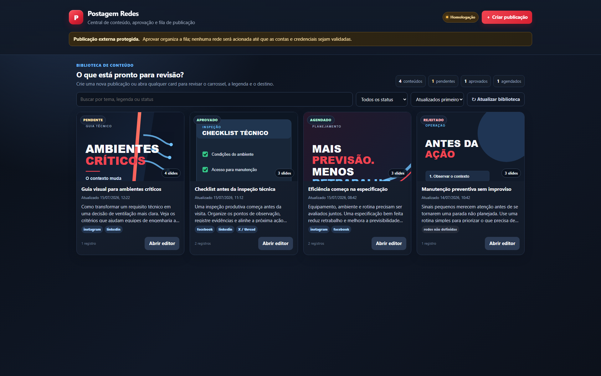
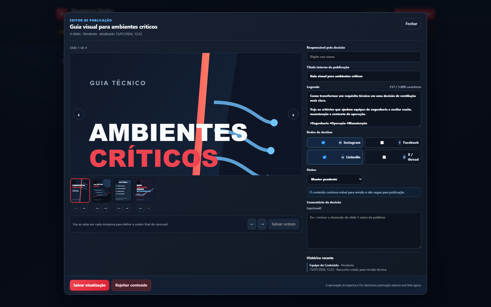
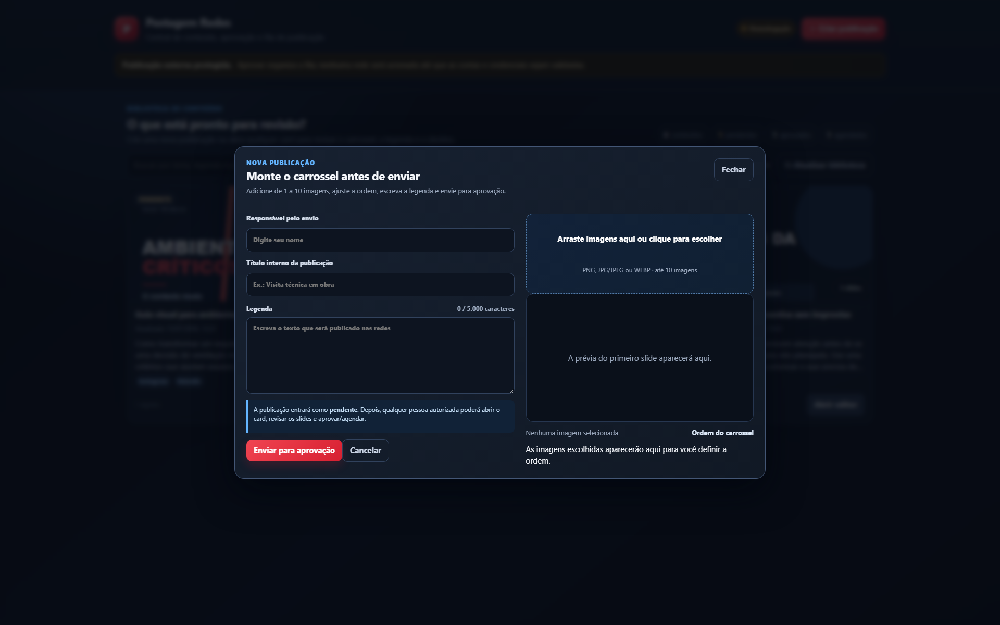
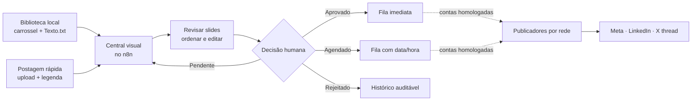

# Postagem Redes

[](https://github.com/Mayconxzdev/PostagemRedes/actions/workflows/validate.yml)

**Projeto autoral de [Maycon Xavier](https://github.com/Mayconxzdev)** — uma central visual construída no n8n para transformar carrosséis técnicos em uma fila clara de revisão, aprovação, agendamento e publicação multicanal.

Em vez de depender de planilhas e passos manuais, quem opera visualiza o conteúdo como ele será publicado, ajusta legenda e destinos, registra a decisão e mantém a rastreabilidade da fila. A publicação externa é uma etapa independente e protegida por homologação de conta.

> Versão de portfólio segura: workflows inativos, dados fictícios, telas anonimizadas e nenhum token, e-mail corporativo, conta social ou imagem de cliente.

## Produto em uso

<p align="center">
  
</p>

<p align="center">
  
  
</p>

As telas acima foram geradas a partir do mesmo template usado pelo portal, usando uma biblioteca demonstrativa anônima. A [demo estática](docs/demo/index.html) e seus assets vivem no repositório para que a interface possa ser revisada sem acesso à infraestrutura interna.

## O problema que resolvi

Em uma operação de conteúdo técnico B2B, aprovar um carrossel não é apenas enviar uma imagem: envolve ordem dos slides, adequação da legenda, canais de destino, agendamento, responsável e histórico da decisão. O fluxo anterior concentrava isso entre planilha, Google Drive e automações difíceis de auditar.

Este projeto cria uma etapa humana e visual antes de qualquer integração externa:



## O que eu construí

| Capacidade | Como funciona |
|---|---|
| Biblioteca visual | Descobre pastas com imagens e `Texto.txt`, identifica carrosséis e monta cards pesquisáveis. |
| Revisão realmente visual | Mostra todos os slides, permite navegação por teclado, edição de título/legenda, seleção de rede e escolha de status. |
| Ordem controlada | O responsável reorganiza o carrossel antes da aprovação; a alteração é persistida e registrada. |
| Postagem rápida | Recebe de 1 a 10 imagens por clique ou arrastar/soltar, exibe prévia e permite reorganizar antes de entrar na fila. |
| Auditoria operacional | Registra operador, data, comentário, destinos e decisão em um ledger local com escrita atômica. |
| Segurança de publicação | Aprovar não publica. Somente conteúdos aprovados/agendados podem seguir para os publicadores depois da homologação das contas. |
| Desempenho da interface | Carrega cards progressivamente, usa imagens preguiçosas e aplica cache aos assets de prévia. |

## Decisões de engenharia

### Separação de responsabilidades

O projeto evita o padrão frágil de um único workflow que gera conteúdo, busca arquivos, publica e tenta recuperar falhas. A arquitetura foi dividida em workflows menores e auditáveis:

| Workflow | Responsabilidade |
|---|---|
| `04 · Portal visual` | Renderiza a biblioteca, filtros e modais. |
| `05 · Portal: ações` | Valida decisões, uploads, ordem dos slides e escreve o ledger. |
| `06 · Portal: arquivos` | Entrega apenas imagens pertencentes ao conteúdo solicitado. |
| `07 · Fila e roteador` | Seleciona itens aprovados/agendados e divide por rede. |
| `08 · Meta` | Prepara o fluxo de carrossel Instagram/Facebook. |
| `09 · LinkedIn Empresa` | Estrutura publicação multi-imagem da Página corporativa. |
| `10 · X thread` | Adapta legenda em sequência e encadeia posts. |
| `11 · Monitoramento` | Sanitiza falhas e encaminha alertas SMTP. |

Os publicadores de redes estão incluídos como **rascunhos inativos**, prontos para receber OAuth e IDs no n8n. Essa separação é intencional: demonstra uma operação segura sem simular uma publicação que ainda não foi homologada.

### Segurança e dados

- Credenciais ficam somente no armazenamento criptografado do n8n; os exports do Git não possuem bloco de credencial.
- A rota de arquivos valida item e nome antes de ler o volume persistente.
- Uploads aceitam apenas PNG, JPG/JPEG e WEBP, com limite de 1 a 10 imagens.
- A interface é adequada à LAN controlada. Para acesso externo, o próximo passo é HTTPS, autenticação e restrição de rede.

## Validação

```powershell
node scripts/build-portal-workflows.mjs
node scripts/build-publisher-workflows.mjs
node scripts/build-portfolio-demo.mjs
node scripts/validate-portal-code.mjs
pwsh -File scripts/validate-workflows.ps1
```

O GitHub Actions valida os exports, impede workflows ativos, bloqueia referências de credenciais e rejeita e-mails reais. A revisão local também confirmou os tipos de nós dos workflows modernos contra a instalação n8n utilizada e verificou conexões internas sem destinos quebrados.

## Tecnologias e competências demonstradas

`n8n` · `Docker` · `JavaScript` · `Node.js` · `Webhooks` · `HTTP APIs` · `OAuth2` · `HTML/CSS responsivo` · `UI/UX operacional` · `Validação de upload` · `Auditoria` · `Idempotência` · `GitHub Actions`

Além da automação, o projeto evidencia decisões de produto: separar aprovação de publicação, reduzir dependência de planilha, oferecer uma tela utilizável para pessoas não técnicas e manter um caminho seguro para evolução de integrações sociais.

## Estrutura do repositório

```text
portal/       Template da interface operacional
workflows/    Exports sanitizados e inativos do n8n
scripts/      Geradores e validadores reproduzíveis
docs/         Arquitetura, segurança, testes e auditoria do legado
docs/demo/    Demonstração estática anonimizada
docs/assets/  Capturas reais da demo e slides ilustrativos
```

## Documentação técnica

- [Portal e operação diária](docs/portal.md)
- [Arquitetura](docs/architecture.md)
- [Configuração e credenciais](docs/setup.md)
- [Segurança](docs/security.md)
- [Plano de testes](docs/testing.md)
- [Migração para nós atuais do n8n](docs/migration.md)
- [Auditoria dos workflows legados](docs/workflow-audit.md)

---

Desenvolvido por **Maycon Xavier** como projeto de portfólio de automação, integração de sistemas e experiência operacional para equipes de marketing técnico.
