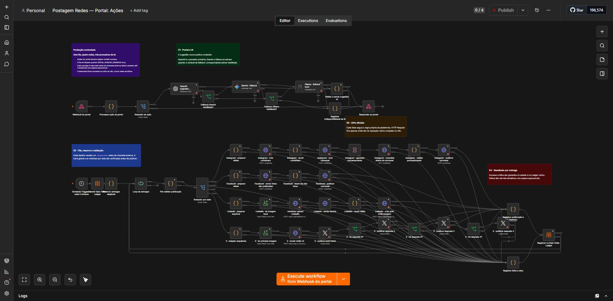

# Postagem Redes

[](https://github.com/Mayconxzdev/PostagemRedes/actions/workflows/validate.yml)

**Projeto autoral de [Mayconxzdev](https://github.com/Mayconxzdev)** para equipes que precisam transformar carrosséis técnicos em publicações revisáveis, rastreáveis e seguras. A operação deixa de depender de planilhas e pastas difíceis de acompanhar: uma pessoa abre uma central visual, revisa o conteúdo e decide o próximo passo antes de qualquer integração externa.

> **Estado verificável:** os três workflows do portal existem e estão ativos na instância local de n8n. Os exports públicos são sanitizados e inativos por design; não contêm contas, tokens, IDs corporativos ou dados de clientes. A publicação externa só é elegível depois da homologação OAuth de cada rede.

## Interface de operação

As telas abaixo usam conteúdo fictício e anonimizado, mas foram geradas a partir do próprio template do portal versionado no repositório.

### Biblioteca de conteúdo

<p align="center">
  
</p>

### Revisão e decisão

<p align="center">
  
</p>

### Postagem rápida sem planilha

<p align="center">
  
</p>

O template navegável e os dados fictícios usados nessas telas estão em [docs/demo](docs/demo/index.html). Ele não chama o n8n nem uma API externa.

## O problema que resolvi

Publicar em quatro redes não é somente copiar uma legenda. O fluxo precisava permitir que uma pessoa não técnica visualizasse o carrossel, ajustasse o texto, escolhesse destinos, organizasse a ordem dos slides, registrasse quem tomou a decisão e evitasse publicação duplicada ou indevida.

| Para quem | O que passa a ser possível | Proteção principal |
|---|---|---|
| Equipe de conteúdo e marketing técnico | Criar ou importar carrosséis, revisar, aprovar e agendar em uma única interface | **Aprovar não publica:** a fila só segue após homologação explícita das contas |

## O que construí

- Portal operacional em HTML, CSS e JavaScript entregue pelo n8n, sem uma aplicação paralela para manter.
- Biblioteca visual que identifica carrosséis e a legenda inicial em `Texto.txt`.
- Editor para revisar slides, texto, redes, status, responsável, comentário e agendamento.
- Postagem rápida com upload de 1 a 10 imagens e controle de ordem antes da aprovação.
- Orquestração com fila por destino, `dispatchId`, retry, ledger e proteção contra duplicidade.
- IA assistiva para rascunho de legenda com fallback OpenAI → Gemini → Ollama; a resposta nunca substitui o texto sem confirmação humana.

## Automação real no n8n

O canvas abaixo é a captura integral do workflow `Portal: Ações` na instância local. Ele reúne entrada do portal, geração assistiva, fila, rotas de publicação por rede e registro de resultado. A captura inteira foi mantida para comprovar a organização real do fluxo; clique para ampliar.

<p align="center">
  <a href="docs/assets/n8n-real/05-portal-acoes-canvas-completo.png">
    
  </a>
</p>

<p align="center"><sub>Canvas real do n8n · 53 nós · portal, IA, fila, APIs por rede e auditoria</sub></p>

| Workflow mantido | Gatilho | Responsabilidade |
|---|---|---|
| `04 · Portal visual` | Webhook `GET` | Lê a biblioteca e entrega a central de revisão, filtros, modais e upload rápido. |
| `05 · Portal: ações` | Webhook `POST` + agenda | Persiste decisões, produz rascunhos, reserva entregas, aplica retry, registra o resultado e contém as rotas de publicação. |
| `06 · Portal: arquivos` | Webhook `GET` | Serve apenas mídia vinculada ao conteúdo solicitado; valida item/nome e suporta URL assinada quando o endpoint público é configurado. |

As capturas completas do workflow auxiliar e os comandos de reprodução estão em [Evidências técnicas](docs/evidence.md).

## Decisões de engenharia

- **Três workflows, não um monólito:** interface, ações e mídia ficam isoladas para reduzir acoplamento e localizar falhas com rapidez.
- **Biblioteca local como fonte de verdade:** operação diária sem Google Sheets ou Google Drive; o estado operacional fica no volume persistente e o histórico por rede vai para o Data Table do n8n.
- **Publicação por destino:** cada rede recebe uma reserva e um `dispatchId` antes da chamada externa, evitando repostagem após retry ou reexecução.
- **APIs oficiais onde é necessário:** carrossel, multiimagem e mídia são implementados com contratos explícitos quando um nó nativo não cobre o caso completo.
- **Segurança por padrão:** credenciais vivem no cofre criptografado do n8n; IA e publicadores começam desligados por variável global.

## Escopo e evidência de integração

| Camada | Estado atual |
|---|---|
| Portal, revisão, upload, estados, fila e auditoria | Implementados nos workflows locais e demonstrados neste repositório. |
| IA assistiva | Implementada como rascunho e desligada até a configuração de credenciais. |
| Instagram, Facebook, LinkedIn e X | Rotas preparadas com APIs oficiais, bloqueadas até OAuth, IDs de conta, mídia HTTPS e teste de homologação por rede. |
| Acesso fora da LAN | Não faz parte da demonstração pública; exige HTTPS, autenticação e restrição de origem antes de exposição. |

Não há alegação de publicação externa concluída neste repositório. Essa separação é intencional: as proteções devem continuar funcionando mesmo quando uma credencial ainda não está pronta.

## Como verificar

```powershell
node scripts/build-portal-workflows.mjs
node scripts/build-portfolio-demo.mjs
node scripts/validate-portal-code.mjs
pwsh -NoProfile -File scripts/validate-workflows.ps1
```

O GitHub Actions reconstrói os exports mantidos e falha se encontrar JSON inválido, credencial serializada, e-mail real, referência interna quebrada ou diferença não versionada.

## Tecnologias demonstradas

`n8n` · `Docker` · `JavaScript` · `Node.js` · `Webhooks` · `HTTP APIs` · `OAuth2` · `HTML/CSS responsivo` · `UI/UX operacional` · `Data Table` · `Idempotência` · `Retry` · `Auditoria` · `GitHub Actions`

## Documentação técnica

- [Evidências visuais dos workflows reais](docs/evidence.md)
- [Arquitetura e fluxo](docs/architecture.md)
- [Portal e operação diária](docs/portal.md)
- [Configuração e homologação segura](docs/setup.md)
- [Segurança](docs/security.md)
- [Plano de testes](docs/testing.md)
- [Migração e atualização dos nós](docs/migration.md)
- [Decisão de consolidação dos workflows](docs/workflow-audit.md)

---

Desenvolvido por **Mayconxzdev** como case study de automação, integração de sistemas e experiência operacional para marketing técnico.
