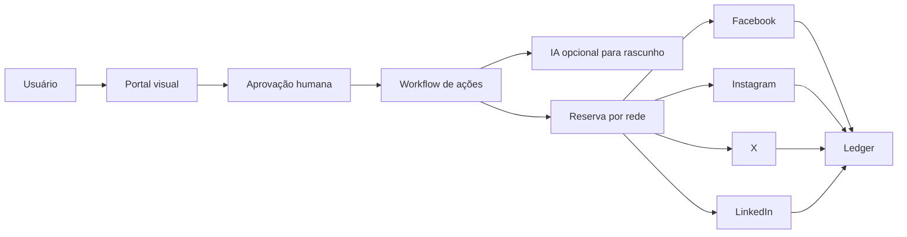

# Postagem Redes

[](https://github.com/Mayconxzdev/PostagemRedes/actions/workflows/validate.yml)

Central visual e três workflows n8n para organizar carrosséis técnicos, revisar legendas, escolher redes, aprovar conteúdo e registrar o resultado individual de cada publicação.

> **Estado atual:** os workflows foram revisados na instância local **n8n 2.33.5**. Facebook e Instagram foram exercitados em ambiente de teste. Uma tentativa posterior no Instagram evidenciou limite do túnel público de mídia; X permanece bloqueado por crédito da conta de teste e LinkedIn depende de acesso à Página. O que está parcial não é apresentado como concluído.

## Leitura rápida para recrutadores

| Dimensão | Evidência |
|---|---|
| **Arquitetura** | Três workflows: portal visual, ações/agendamento e serviço controlado de arquivos. |
| **Escala técnica** | O workflow de ações possui 58 nós no snapshot público atual. |
| **IA aplicada** | OpenAI → Gemini → Ollama como cadeia opcional para rascunho, sempre sujeita à aprovação humana. |
| **Integrações** | Meta Graph API, OAuth2, APIs HTTP e resultado independente por rede. |
| **Confiabilidade** | Reserva por destino, `dispatchId`, idempotência, retry, ledger e falha isolada por canal. |
| **Qualidade pública** | Exports inativos e sanitizados, demo sem chamadas externas, validação de privacidade e GitHub Actions. |

## Problema resolvido

Conteúdo técnico ficava espalhado entre pastas, planilhas e mensagens. A solução reúne:

- biblioteca visual de carrosséis;
- revisão de legenda e prévia;
- responsável, comentário, canais e agendamento;
- geração assistida de rascunho;
- aprovação humana antes das APIs externas;
- fila e resultado individual por rede;
- histórico e ledger de entregas.

## Estado por canal

| Canal | Resultado conhecido | Situação correta |
|---|---|---|
| **Facebook** | Publicação multi-imagem confirmada em Página de teste controlada. | **Comprovado em teste** |
| **Instagram** | OAuth e publicação foram exercitados; tentativa posterior de seis imagens falhou pelo tempo de download através do túnel. | **Validado com limite de infraestrutura** |
| **X** | Rota e registro existem; conta de teste retornou limite de créditos. | **Bloqueado pelo provedor** |
| **LinkedIn** | Fluxo preparado, mas credencial e acesso à Página não foram fornecidos. | **Pendente de acesso externo** |

Essa separação evita transformar contrato implementado em promessa de operação contínua.

## Interface demonstrativa

### Biblioteca


### Revisão e decisão


### Postagem rápida


As telas usam conteúdo fictício e anonimizado. A [demo navegável](docs/demo/index.html) não chama n8n nem serviços externos.

## Workflows

| Workflow | Gatilho | Responsabilidade |
|---|---|---|
| `Portal Visual` | Webhook `GET` | Biblioteca, filtros, prévias, modais e upload rápido. |
| `Portal: Ações` | Webhook `POST` + agenda | Decisões, rascunho assistido, reservas, publicação, falhas e ledger. |
| `Portal: Arquivos` | Webhook `GET` | Entrega somente a mídia validada do conteúdo solicitado. |

O export [`05-portal-acoes.sanitized.json`](workflows/05-portal-acoes.sanitized.json) possui 58 nós, está inativo por segurança e passa pela validação automática.


## Fluxo de decisão


```mermaid
flowchart LR
    U[Usuário] --> P[Portal visual]
    P --> H[Aprovação humana]
    H --> A[Workflow de ações]
    A --> AI[IA opcional para rascunho]
    A --> R[Reserva por rede]
    R --> FB[Facebook]
    R --> IG[Instagram]
    R --> X[X]
    R --> LI[LinkedIn]
    FB --> L[Ledger]
    IG --> L
    X --> L
    LI --> L
```

## Decisões de engenharia

- interface, ações e mídia isolados em três workflows;
- OAuth mantido no cofre do n8n;
- chamadas Graph específicas implementadas por HTTP quando o nó oficial não cobre o contrato necessário;
- cada rede recebe reserva e `dispatchId` antes da API;
- falha em um canal não cancela os demais;
- sugestões de IA não substituem a legenda aprovada;
- portal sem login permanece limitado à LAN;
- PostgreSQL é o próximo passo caso concorrência e retenção cresçam.

## Documentação

- [Arquitetura](docs/architecture.md)
- [Evidências técnicas](docs/evidence.md)
- [Operação do portal](docs/portal.md)
- [Setup seguro](docs/setup.md)
- [Segurança](docs/security.md)
- [Testes e próximos gates](docs/testing.md)
- [Migração](docs/migration.md)
- [Exports sanitizados](workflows/README.md)

## Validar a cópia pública

```powershell
node scripts/build-portfolio-demo.mjs
node scripts/validate-portfolio-workflows.mjs
node scripts/validate-portal-code.mjs
pwsh -NoProfile -File scripts/validate-workflows.ps1
```

A validação rejeita JSON inválido, credenciais serializadas, e-mails reais, IDs internos, domínios temporários de túnel e exports ativos.

## Tecnologias

`n8n 2.33.5` · `Docker` · `JavaScript` · `Node.js` · `Webhooks` · `OAuth2` · `Meta Graph API` · `HTTP APIs` · `HTML/CSS` · `Data Tables` · `Idempotência` · `Retry` · `Auditoria` · `GitHub Actions`

## Autor

**Maycon Ferreira** — produto, workflows, integrações, IA aplicada, UX operacional, testes e documentação.
