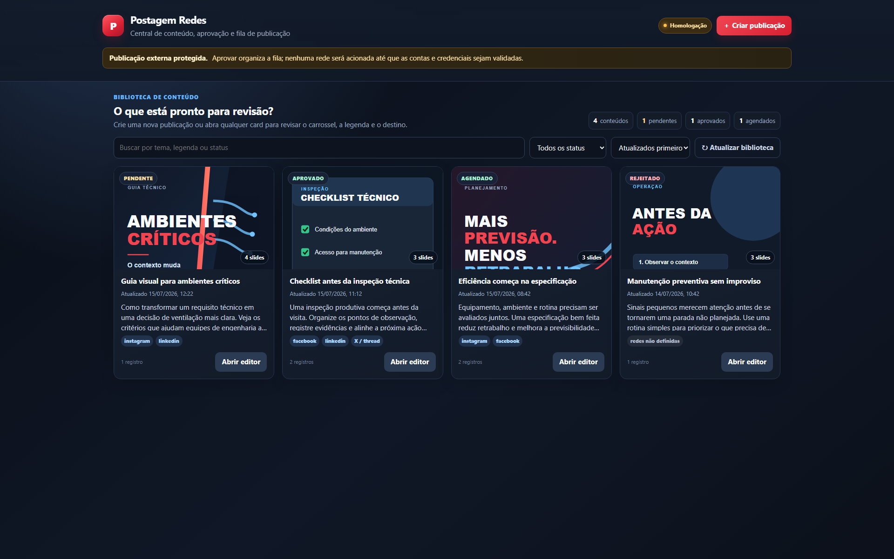
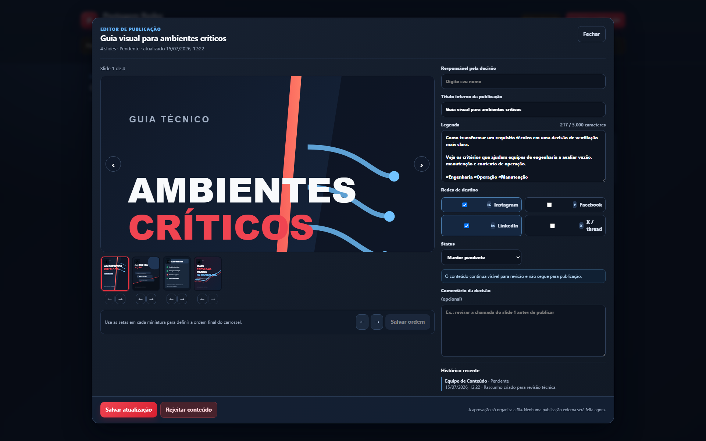
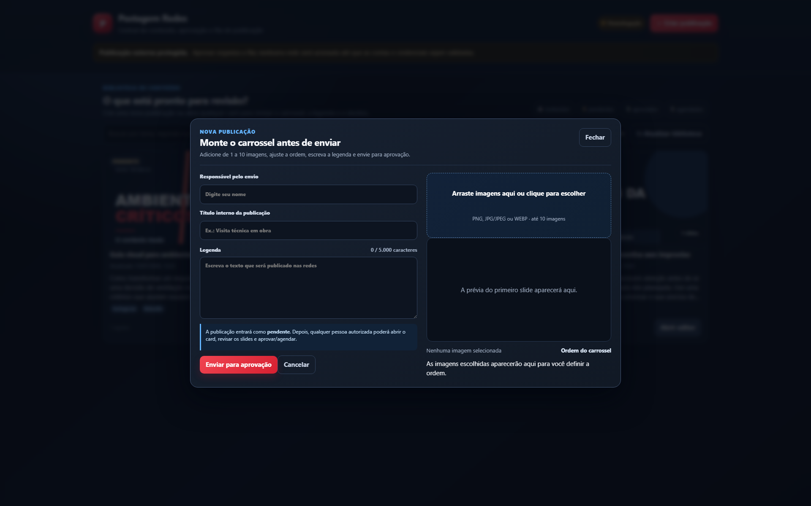
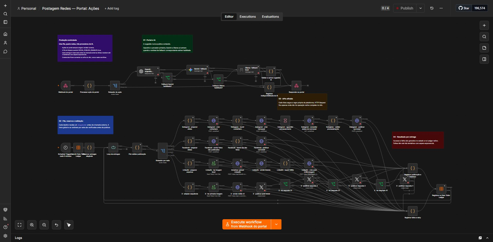

# Postagem Redes

[](https://github.com/Mayconxzdev/PostagemRedes/actions/workflows/validate.yml)

Case study autoral de **Maycon Ferreira** para transformar uma pasta de carrosséis técnicos em uma fila visual, revisável e rastreável de publicação. A operação deixa de depender de planilha: a equipe abre uma central no navegador, organiza as imagens, adapta a legenda, escolhe os canais e registra a decisão antes de qualquer chamada externa.

### Como as publicações validadas foram iniciadas

Os testes de publicação no Facebook e no Instagram foram iniciados pela central visual criada para a equipe.

Após revisar o conteúdo e confirmar a decisão no portal, a ação acionou o workflow correspondente no n8n e seguiu para a API da rede social. Não houve uma etapa manual adicional fora do fluxo depois da confirmação no portal.

> **Leitura honesta do estado:** o portal e os três workflows estão ativos na instância local de n8n 2.32.5. Em 28/07/2026, uma publicação multi-imagem no Facebook foi confirmada em uma Página de teste controlada; o fluxo do Instagram também foi validado em teste, mas uma tentativa posterior de seis slides revelou o limite atual do túnel público de mídia (`download` remoto da Meta excedeu o tempo). X está bloqueado por crédito da conta de teste e LinkedIn aguarda acesso à Página. O que está parcial fica documentado — não é apresentado como pronto.

## Em um minuto

| Problema operacional | Resposta construída | Proteção que evita erro de operação |
|---|---|---|
| Conteúdo disperso em pasta e planilha | Biblioteca visual de carrosséis, legenda e status | A biblioteca é lida localmente; a decisão fica registrada no estado e no ledger. |
| Aprovação por mensagem informal | Editor com prévia, responsável, comentário, redes e agendamento | A IA sugere; uma pessoa confirma o texto e o destino. |
| Uma falha bloquear todas as redes | Entrega independente por rede, `dispatchId`, retry e resultado individual | Uma falha no X ou LinkedIn não cancela Facebook/Instagram. |
| Reexecutar e publicar em duplicidade | Reserva antes da chamada externa e confirmação por destino | A publicação já confirmada não entra novamente na fila. |

## Interface de operação

As telas a seguir usam conteúdo fictício e anonimizado, gerado a partir do próprio template versionado. A [demo navegável](docs/demo/index.html) não chama n8n nem serviços externos.

### Biblioteca de conteúdo

<p align="center">
  
</p>

### Revisão e decisão

<p align="center">
  
</p>

### Postagem rápida sem planilha

<p align="center">
  
</p>

## O que existe de verdade no n8n

O ambiente ativo mantém **três workflows**, com responsabilidades separadas. O export público é um snapshot sanitizado e inativo: preserva canvas, nós e conexões para revisão técnica, mas remove credenciais, IDs, dados de execução e referências internas.

| Workflow | Gatilho | Responsabilidade |
|---|---|---|
| `Portal Visual` | Webhook `GET` | Lê a biblioteca e entrega a central de revisão, filtros, prévias, modais e upload rápido. |
| `Portal: Ações` | Webhook `POST` + agenda | Persiste decisões, gera rascunho assistido, reserva entregas, publica por rede, trata falhas e registra resultado. |
| `Portal: Arquivos` | Webhook `GET` | Serve somente a mídia validada de um conteúdo solicitado; não expõe o volume inteiro. |

O canvas abaixo é uma captura do editor real do n8n no marco inicial da arquitetura. Para inspecionar o snapshot atual, use o export [`05-portal-acoes.sanitized.json`](workflows/05-portal-acoes.sanitized.json): ele possui 58 nós, está inativo por segurança e passa pela validação automática do repositório.

<p align="center">
  <a href="docs/assets/n8n-real/05-portal-acoes-canvas-completo.png">
    
  </a>
</p>

<p align="center"><sub>Captura real do n8n; clique para ampliar. O snapshot público atual e a evolução do canvas estão explicados em <a href="docs/evidence.md">Evidências técnicas</a>.</sub></p>

## Evidência de integração, sem marketing artificial

| Verificação | Resultado conhecido | Situação de portfólio |
|---|---|---|
| Portal, arquivos e ações | Três workflows ativos em n8n 2.32.5; portal acessível na LAN | **Comprovado** em ambiente local. |
| Facebook multi-imagem | Seis mídias enviadas como não publicadas e reunidas em um post de Página via Graph API | **Comprovado** em Página de teste; imagem/identidade corporativa não entram no repositório. |
| Instagram carrossel | OAuth e publicação foram exercitados; campanha posterior falhou porque a Meta demorou a baixar seis imagens do túnel público | **Parcial**, com causa técnica e correção planejada: origem HTTPS estável e mídia otimizada. |
| X/thread | Rota e registro por entrega existem; conta de teste retornou limite de créditos | **Bloqueado pelo provedor**, sem mascarar a falha. |
| LinkedIn | Fluxo multi-imagem preparado; credencial e acesso à Página ainda não foram fornecidos | **Pendente de acesso externo**. |

Essa separação é deliberada. Um recrutador consegue ver a arquitetura, o contrato de cada rede e os guardrails; ao mesmo tempo, não recebe uma promessa falsa de “quatro redes 100% concluídas”. Veja o detalhe em [Evidências técnicas](docs/evidence.md) e o plano objetivo em [Testes e próximos gates](docs/testing.md).

## Decisões de engenharia

- **Três workflows, não um monólito:** interface, ações e mídia isolados para reduzir acoplamento e localizar falhas rapidamente.
- **HTTP Request somente onde importa:** o OAuth fica no cofre do n8n; chamadas Graph específicas de carrossel/multiimagem são explícitas porque o nó oficial não cobre todo o contrato de containers, polling e publicação.
- **Entrega por destino:** cada rede recebe uma reserva e um `dispatchId` antes da API. Facebook, Instagram, LinkedIn e X não dependem do sucesso umas das outras.
- **Humano no comando:** OpenAI → Gemini → Ollama é uma cadeia opcional de rascunho. Nenhuma sugestão altera a legenda aprovada sem uma ação no portal.
- **Dados locais na escala atual:** biblioteca e estado persistem no volume do n8n; Data Table funciona como ledger consultável. PostgreSQL é o próximo passo se concorrência e retenção crescerem.
- **Segurança antes de conveniência:** credenciais não aparecem em Code nodes, exports, screenshots ou Git; o portal sem login permanece limitado à LAN.

## O que um avaliador pode revisar

- [Arquitetura e fluxo por componente](docs/architecture.md)
- [Evidência técnica e limite atual do Instagram](docs/evidence.md)
- [Como o portal é usado no dia a dia](docs/portal.md)
- [Configuração segura e homologação de contas](docs/setup.md)
- [Threat model prático e limites da LAN](docs/security.md)
- [Plano de testes, resultados e próximos gates](docs/testing.md)
- [Atualização dos nós e decisão de manter três workflows](docs/migration.md)
- [Exports n8n sanitizados](workflows/README.md)

## Como validar a cópia pública

```powershell
node scripts/build-portfolio-demo.mjs
node scripts/validate-portfolio-workflows.mjs
node scripts/validate-portal-code.mjs
pwsh -NoProfile -File scripts/validate-workflows.ps1
```

O GitHub Actions executa essas verificações a cada push e pull request. Ele rejeita JSON inválido, credenciais serializadas, e-mail real, ID de instância, domínio temporário de túnel e export ativo.

## Tecnologias demonstradas

`n8n` · `Docker` · `JavaScript` · `Node.js` · `Webhooks` · `OAuth2` · `Meta Graph API` · `HTTP APIs` · `HTML/CSS responsivo` · `UI/UX operacional` · `Data Table` · `Idempotência` · `Retry` · `Auditoria` · `GitHub Actions`

---

Desenvolvido por **Maycon Ferreira** como case study de automação, integração de sistemas e experiência operacional para equipes de marketing técnico.
