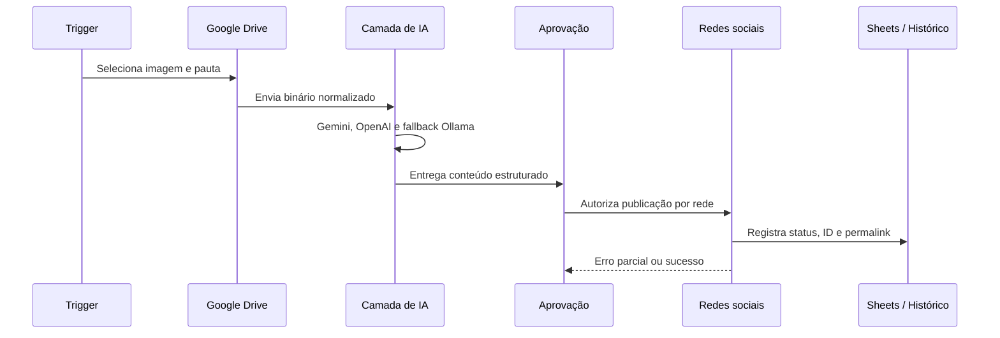

# Arquitetura

## Princípio operacional

O workflow legado concentra geração e publicação no mesmo orquestrador. Na migração, ele permanece inativo para que a aprovação humana seja introduzida antes de qualquer ação externa. A arquitetura-alvo abaixo separa a geração da decisão de publicação, permitindo revisar textos e imagens e mantendo o histórico de cada rede auditável.

## Componentes

### Entrada e conteúdo

- O export original traz um gatilho ativo às 09h, às segundas, quartas e sextas, e um segundo gatilho desativado às 13h, às terças, quartas e quintas. Esses horários são pontos de configuração, não uma política definitiva.
- Um webhook recebe binários para análise sob demanda.
- O Google Drive é usado para selecionar, baixar e arquivar imagens.

### Inteligência e fallback

1. Gemini interpreta a imagem e gera contexto técnico.
2. OpenAI monta a redação principal.
3. Ollama funciona como redundância local quando serviços externos falham.
4. Nós de auditoria verificam saída, tamanho e presença de dados essenciais.

### Publicação e rastreabilidade

- Facebook e Instagram usam a Meta Graph API.
- LinkedIn possui rotas independentes por conta.
- X usa upload de mídia e publicação separados.
- Google Sheets registra conteúdo já utilizado, reduzindo duplicidade.
- Google Drive recebe a mídia concluída em uma pasta de processados.

### Operação

- Um workflow global de erro recebe falhas não tratadas.
- Um assistente de retry pode reexecutar uma execução específica mediante autenticação.
- Alertas por e-mail informam sucesso e falhas parciais.

## Limites deliberados

O projeto não ativa publicações automaticamente até que todas as credenciais, permissões de cada plataforma e o modo de aprovação tenham sido homologados. O export legado ainda não contém uma fila de aprovação obrigatória; a evolução recomendada é registrar cada rascunho com os estados `draft`, `approved`, `rejected`, `publishing`, `published` e `failed`, e permitir que somente `approved` alcance o roteador de redes. Isso evita publicação indevida durante instalação ou manutenção.
