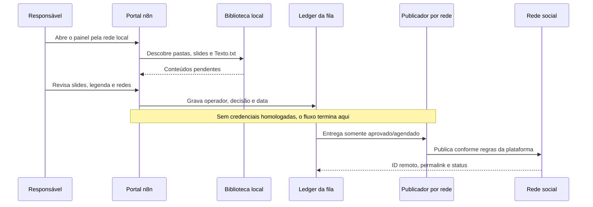

# Arquitetura

## Princípio operacional

O projeto separa claramente três responsabilidades que costumam ficar misturadas em automações de redes sociais:

1. **Preparar conteúdo** — receber carrosséis e legendas de uma biblioteca local ou de um envio rápido.
2. **Decidir com uma pessoa** — visualizar o resultado e registrar aprovação, agendamento, rejeição ou necessidade de ajuste.
3. **Publicar por plataforma** — ação externa que só pode consumir itens aprovados depois da homologação de credenciais e regras de cada API.



## Portal visual

O portal é composto por três webhooks de produção do n8n, todos no mesmo host/porta da instância:

| Rota | Método | Função |
|---|---:|---|
| `/webhook/postagem-redes` | `GET` | Renderiza biblioteca, filtros, modais e prévia do carrossel. |
| `/webhook/postagem-redes-api` | `POST` | Recebe decisão em JSON ou imagens enviadas pelo formulário de postagem rápida. |
| `/webhook/postagem-redes-arquivo` | `GET` | Entrega uma imagem já validada como pertencente ao conteúdo solicitado. |

Os workflows usam nós **Code** restritos ao volume persistente `/files/postagem-redes`. O endpoint de arquivos rejeita nomes com caminho, extensões não permitidas e itens que não pertençam à biblioteca atual.

## Biblioteca e estado

Estrutura operacional esperada:

```text
postagem-redes/
├── entrada/
│   └── meu-carrossel/
│       ├── 01.png
│       ├── 02.png
│       └── Texto.txt
├── rascunhos/
├── rejeitados/
├── publicados/
└── state.json
```

- Cada subpasta em `entrada/` é um conteúdo. O portal suporta PNG, JPG/JPEG e WEBP.
- `Texto.txt` fornece a legenda inicial; alterações feitas no portal ficam registradas no estado, sem sobrescrever o arquivo original.
- `state.json` armazena apenas metadados de operação: estado, título/legenda aprovados, redes, data, auditoria e agendamento. A escrita usa arquivo temporário, rename atômico e lock simples para reduzir conflito entre usuários.
- Para uploads pelo navegador, o Code node lê cada arquivo com `getBinaryDataBuffer()`, em vez de acessar a referência interna do binário. Isso preserva compatibilidade com o armazenamento `filesystem-v2` usado por versões atuais do n8n.
- O JSON é adequado para a atual biblioteca pequena e LAN. O workflow também mantém uma Data Table nativa do n8n chamada `Postagem Redes - Ledger` como espelho consultável dos resultados por rede. Para alta concorrência ou auditoria regulatória, a evolução correta é mover também a reserva da fila para PostgreSQL.

## Publicação por plataforma

`Portal: Ações` é o orquestrador real. A cada cinco minutos ele reserva exclusivamente entregas `aprovado` ou `agendado`, uma rede por vez, antes de qualquer chamada externa. A trava `SOCIAL_PUBLISH_ENABLED=false` impede o disparo até a homologação. Cada rede recebe um `dispatchId`, três tentativas no máximo com espera exponencial, registro no `state.json` e espelho no Ledger do n8n.

| Plataforma | Adaptação necessária |
|---|---|
| Instagram | Cria containers por slide, cria o carrossel, aguarda, consulta `status_code` e só publica quando a Meta retornar `FINISHED`. Requer mídia HTTPS pública; quando a assinatura estiver ligada, usa links temporários assinados. |
| Facebook | Envia fotos não publicadas, reúne IDs de mídia e cria o post da Página com `attached_media`. |
| LinkedIn | Lê cada imagem no volume n8n, inicializa/upload binário, reúne URNs e cria post multi-imagem na Página da empresa. |
| X | Lê/upload da primeira mídia pela API v2, publica o post inicial e encadeia até três respostas com o nó nativo X v2. |

## Orquestração consolidada

O ambiente operacional mantém somente três workflows ativos para Postagem Redes:

| Workflow | Responsabilidade em produção |
|---|---|
| `Portal Visual` | Renderiza a biblioteca, o editor, prévias e URLs de mídia assinadas quando o domínio público estiver configurado. Um nó de documentação deixa explícito que não há publicação nesse fluxo. |
| `Portal: Ações` | Recebe ações do portal, gera IA com fallback OpenAI → Gemini → Ollama, reserva a fila, publica nas quatro redes, aplica retry, salva auditoria e espelha o Ledger nativo. O canvas é dividido visualmente em Portal/IA, Fila, APIs oficiais e Resultado. |
| `Portal: Arquivos` | Entrega somente arquivos pertencentes ao conteúdo solicitado; no modo público exige assinatura HMAC e expiração curta. Um nó de documentação descreve a proteção do endpoint. |

O estado por rede fica em `deliveries`: `draft`, `queued`, `dispatching`, `retry`, `published`, `failed` ou `blocked`. Esse modelo permite retomar uma única rede sem repetir uma publicação já confirmada em outra. O `dispatchId` é reservado antes da chamada externa; confirmações só atualizam a entrega correspondente.

## Proteções de ativação

- A IA só é acionada se `SOCIAL_AI_ENABLED=true`; seu retorno é um rascunho e nunca substitui a legenda sem uma ação explícita da pessoa responsável.
- A publicação externa fica desligada enquanto `SOCIAL_PUBLISH_ENABLED` não for habilitada depois de cada conta ser homologada.
- A entrega pública de mídias só é exigida quando `SOCIAL_MEDIA_REQUIRE_SIGNED_URLS=true`; os links incluem assinatura HMAC e expiração de duas horas.

Os caminhos históricos de planilha, Drive, alertas e retry não fazem parte dos exports públicos. As responsabilidades que continuam úteis foram consolidadas nos três workflows mantidos; a decisão está documentada em [workflow-audit.md](workflow-audit.md).
