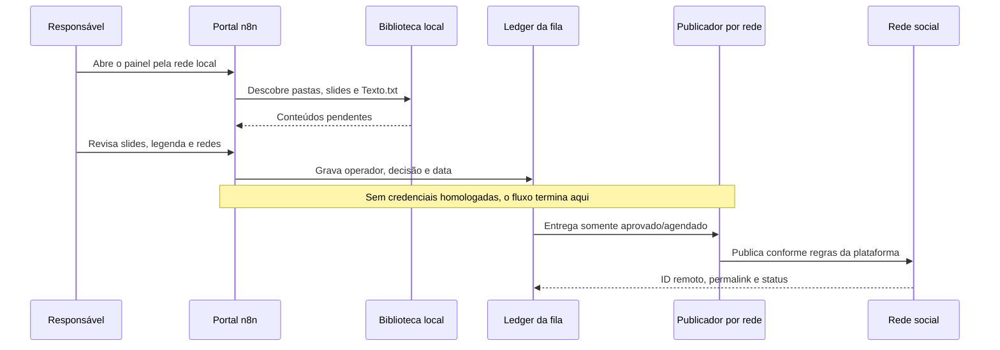

# Arquitetura

## Princípio operacional

O projeto separa claramente três responsabilidades que costumam ficar misturadas em automações de redes sociais:

1. **Preparar conteúdo** — receber carrosséis e legendas de uma biblioteca local ou de um envio rápido.
2. **Decidir com uma pessoa** — visualizar o resultado e registrar aprovação, agendamento, rejeição ou necessidade de ajuste.
3. **Publicar por plataforma** — ação externa que só pode consumir itens aprovados depois da homologação de credenciais e regras de cada API.



## Portal visual

O portal é composto por três webhooks de produção do n8n, todos no mesmo host/porta da instância:

| Rota | Método | Função |
|---|---:|---|
| `/webhook/postagem-redes` | `GET` | Renderiza biblioteca, filtros, modais e prévia do carrossel. |
| `/webhook/postagem-redes-api` | `POST` | Recebe decisão em JSON ou imagens enviadas pelo formulário de postagem rápida. |
| `/webhook/postagem-redes-arquivo` | `GET` | Entrega uma imagem já validada como pertencente ao conteúdo solicitado. |

Os workflows usam nós **Code** restritos ao volume persistente `/files/postagem-redes`. O endpoint de arquivos rejeita nomes com caminho, extensões não permitidas e itens que não pertençam à biblioteca atual.

## Biblioteca e estado

Estrutura operacional esperada:

```text
postagem-redes/
├── entrada/
│   └── meu-carrossel/
│       ├── 01.png
│       ├── 02.png
│       └── Texto.txt
├── rascunhos/
├── rejeitados/
├── publicados/
└── state.json
```

- Cada subpasta em `entrada/` é um conteúdo. O portal suporta PNG, JPG/JPEG e WEBP.
- `Texto.txt` fornece a legenda inicial; alterações feitas no portal ficam registradas no estado, sem sobrescrever o arquivo original.
- `state.json` armazena apenas metadados de operação: estado, legenda aprovada, redes, data, auditoria e agendamento. A escrita usa arquivo temporário, rename atômico e lock simples para reduzir conflito entre usuários.
- O JSON é adequado para a atual biblioteca pequena e LAN. Para alta concorrência, auditoria regulatória ou muitas campanhas, a evolução correta é mover a fila e o histórico para PostgreSQL/Data Table.

## Publicação futura por plataforma

O portal não chama APIs sociais. A próxima camada deve consumir somente registros `aprovado` ou `agendado`, criar uma chave de idempotência por conteúdo/rede e registrar `publishing`, `published` ou `failed`.

| Plataforma | Adaptação necessária |
|---|---|
| Instagram / Facebook | Publicar carrossel/mídia pela API Graph, respeitando as regras atuais de conta Business/Page. |
| LinkedIn | Usar a rota atual de publicação multi-imagem e registrar URNs/permalinks. |
| X | Converter o carrossel em sequência/thread: um post inicial e respostas encadeadas, com mídia e texto adaptados aos limites da plataforma. |

Os workflows legados de IA, Google Drive/Sheets, alertas e retry permanecem isolados. Podem alimentar esta fila posteriormente, mas não são necessários para que uma pessoa use o portal local.
