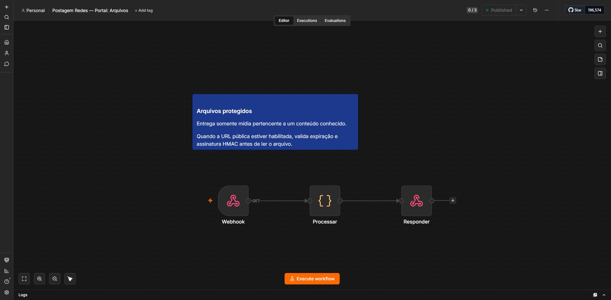

# Evidências técnicas

Capturas feitas no editor da instância local n8n em 15/07/2026. Elas mostram os workflows como foram organizados para operação; os exports do repositório permanecem sanitizados e não carregam credenciais ou contas sociais.

## `05 · Portal: Ações`

<p align="center">
  <a href="assets/n8n-real/05-portal-acoes-canvas-completo.png">
    
  </a>
</p>

O orquestrador principal possui 53 nós organizados por responsabilidade: entrada e IA, fila, publicação por rede e resultado. A imagem inteira preserva o contexto do fluxo; clique nela para ampliar.

## `06 · Portal: Arquivos`

<p align="center">
  <a href="assets/n8n-real/06-portal-arquivos-canvas-completo.png">
    
  </a>
</p>

Workflow isolado para servir mídia autorizada ao portal: recebe a solicitação, valida o arquivo solicitado e responde o binário. A separação impede que a tela de aprovação tenha acesso direto e irrestrito ao volume de mídia.

## `04 · Portal Visual`

O terceiro workflow mantido é o `Portal Visual`: um webhook `GET` que lê a biblioteca e entrega a interface de revisão. A demonstração do resultado dessa camada está na seção [Interface de operação](../README.md#interface-de-operação).

## Reprodução

```powershell
node scripts/build-portal-workflows.mjs
node scripts/validate-portal-code.mjs
pwsh -NoProfile -File scripts/validate-workflows.ps1
```

Esses comandos regeneram e validam os três exports sanitizados; não conectam contas e não executam publicações externas.
