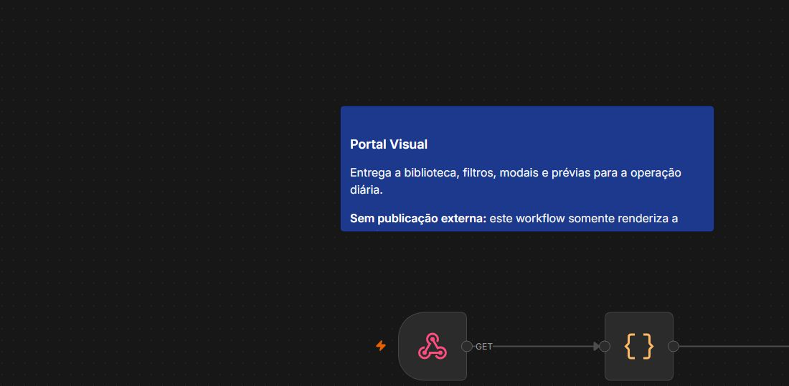
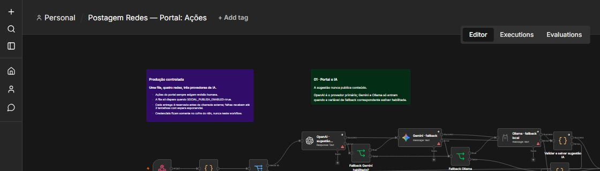
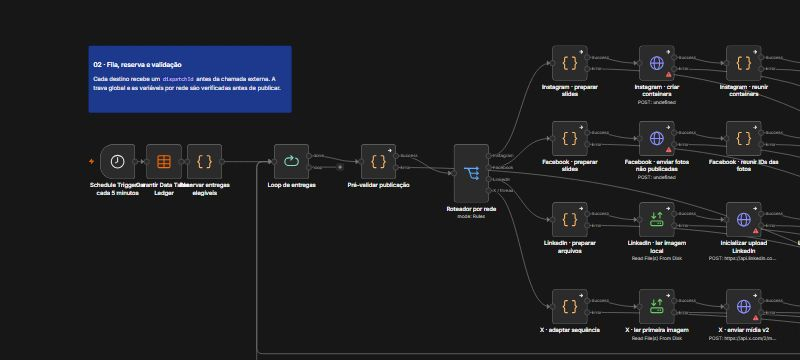
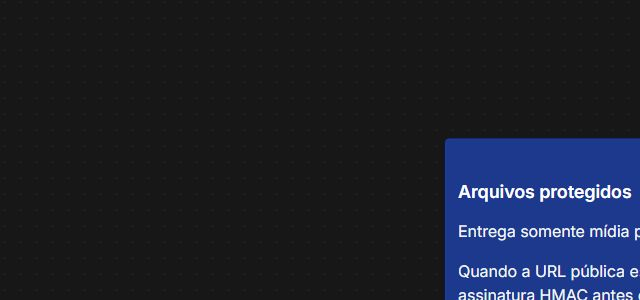

# Evidências da implementação

## Origem das capturas

As imagens abaixo foram capturadas no editor da instância local do **n8n 2.27.3**, em **15/07/2026**, depois da consolidação dos workflows do portal. São registros da interface real do n8n, não diagramas desenhados para o README.

O enquadramento remove apenas áreas periféricas da janela. Não há credenciais, tokens, contas sociais, IDs corporativos, e-mails ou dados de clientes nas imagens. Os exports versionados continuam sanitizados e inativos para que possam ser inspecionados com segurança.

## `04 · Portal visual`

<p align="center">
  
</p>

Entrada `GET` do portal. Este workflow se limita a construir a interface a partir da biblioteca e a responder o HTML; ele não decide, não agenda e não publica.

## `05 · Portal: ações` — entrada e IA

<p align="center">
  
</p>

O fluxo recebe a ação do portal, normaliza a solicitação e direciona a geração assistiva. O bloco mostra OpenAI como primário e Gemini/Ollama como alternativas; variáveis mantêm todos desligados até a configuração das credenciais. O resultado da IA é salvo como rascunho.

## `05 · Portal: ações` — fila e roteamento

<p align="center">
  
</p>

O agendador consulta a fila, seleciona somente itens elegíveis, cria a reserva de entrega e distribui por rede. A publicação externa fica depois das verificações e da trava global, não no caminho de aprovação do usuário.

## `06 · Portal: arquivos`

<p align="center">
  
</p>

Endpoint dedicado à mídia. Ele existe para que o portal receba apenas arquivos pertencentes ao conteúdo solicitado e possa evoluir para URL temporária assinada em uma exposição HTTPS.

## Como reproduzir a revisão

```powershell
node scripts/build-portal-workflows.mjs
node scripts/validate-portal-code.mjs
pwsh -NoProfile -File scripts/validate-workflows.ps1
```

Os comandos recriam os três exports sanitizados e verificam a política de publicação do portfólio. Eles não conectam contas nem fazem chamadas para APIs sociais.
