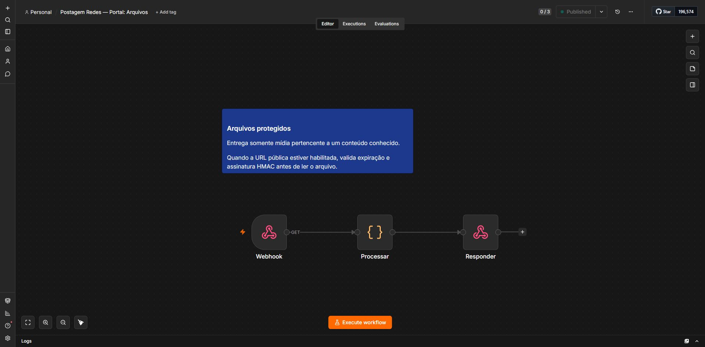

# Evidências técnicas

Este documento separa **o que foi observado** do que ainda é um gate externo. A última conferência técnica ocorreu em 28/07/2026 na instância local n8n **2.32.5**. Capturas e exports públicos são sanitizados: não carregam credenciais, IDs de contas, dados de cliente, domínio do túnel ou histórico de execução.

## Matriz de evidência

| Camada | Evidência | Estado |
|---|---|---|
| Orquestrador | `Portal: Ações` ativo, 58 nós e 51 grupos de conexão no ambiente local | Comprovado localmente |
| Portal | Biblioteca visual, editor, decisão, reordenação e upload rápido | Comprovado no portal e na demo sanitizada |
| Facebook | Fluxo enviou seis fotos não publicadas e criou publicação multi-imagem de uma Página de teste via Graph API | Comprovado em integração controlada |
| Instagram | OAuth/publicação exercitados; em uma nova campanha a Meta retornou timeout ao buscar seis imagens no endpoint público | Parcial; causa observada, não uma falha de OAuth |
| X | Rota configurada e falha registrada de forma isolada quando a conta de teste não tinha crédito | Bloqueado pelo provedor |
| LinkedIn | Rota multi-imagem preparada, sem credencial/acesso de Página para homologar | Pendente de acesso externo |

O resultado de Instagram não é escondido porque ele é exatamente o tipo de detalhe que diferencia uma automação de demonstração de uma integração operacional: a Meta baixa a mídia a partir da URL HTTPS; aumentar somente o timeout do n8n não resolve uma demora do downloader remoto. O próximo gate é hospedar imagens otimizadas em origem HTTPS estável antes de repetir o teste, sempre com conteúdo novo para não criar duplicidade.

## Canvas n8n real: Portal: Ações

<p align="center">
  <a href="assets/n8n-real/05-portal-acoes-canvas-completo.png">
    
  </a>
</p>

A captura registra o marco inicial do canvas na instância local. O snapshot sanitizado atual evoluiu para 58 nós e está em [`../workflows/05-portal-acoes.sanitized.json`](../workflows/05-portal-acoes.sanitized.json). Ele mantém o desenho que importa para revisão: entrada do portal e IA, reserva da fila, adaptadores por rede e resultado por entrega.

## Canvas n8n real: Portal: Arquivos

<p align="center">
  <a href="assets/n8n-real/06-portal-arquivos-canvas-completo.png">
    
  </a>
</p>

O workflow de arquivos recebe uma solicitação, valida conteúdo/nome/extensão e responde somente o binário autorizado. Essa fronteira é necessária porque Facebook e Instagram precisam de uma URL pública de mídia, enquanto o portal não deve expor o volume inteiro.

## Como reproduzir a revisão pública

```powershell
node scripts/build-portfolio-demo.mjs
node scripts/validate-portfolio-workflows.mjs
node scripts/validate-portal-code.mjs
pwsh -NoProfile -File scripts/validate-workflows.ps1
```

Os comandos validam os três exports sanitizados e a demo. Eles não conectam contas nem executam publicações externas.
