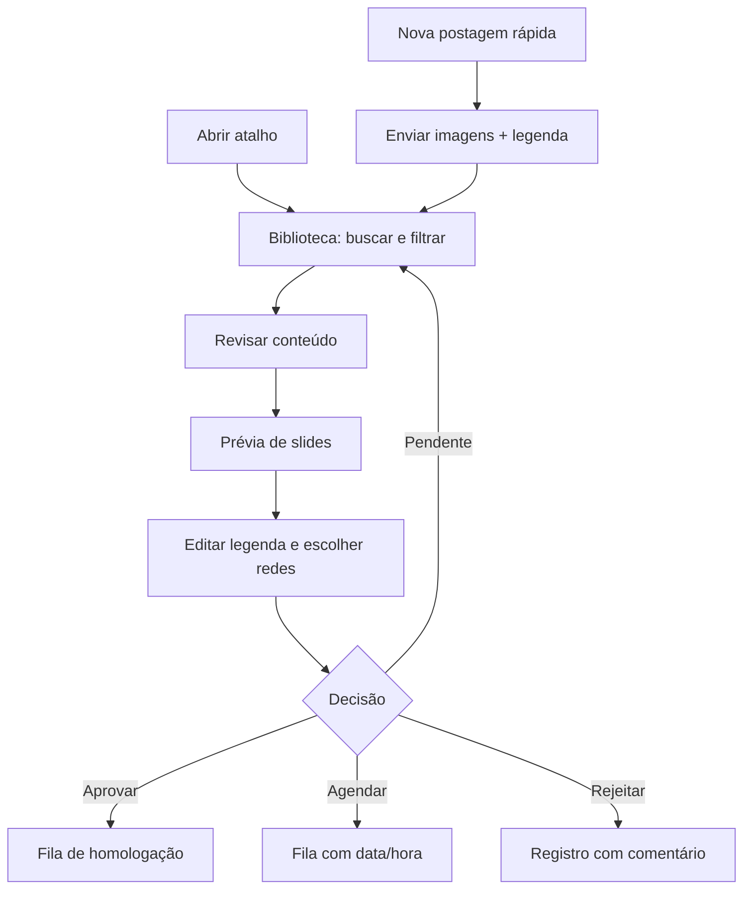

# Portal visual de aprovação

## Objetivo

O portal reduz a dependência de planilhas e tarefas manuais para uma operação diária simples: adicionar conteúdo, enxergar o carrossel como ele será revisado, ajustar a mensagem e registrar uma decisão antes de qualquer publicação externa.

Ele roda como uma interface HTML entregue pelo próprio n8n. Assim, não existe um segundo servidor ou aplicação para manter: o atalho abre uma rota do n8n já usada pela empresa.

## Interface e fluxo

### Biblioteca

Cada card mostra miniatura, título, quantidade de slides, estado, resumo da legenda e redes selecionadas. Os filtros distinguem pendentes, aprovados, agendados, rejeitados e itens incompletos.

### Revisão

Ao abrir **Revisar**, a pessoa vê todos os slides do carrossel. Pode trocar a legenda, marcar Instagram, Facebook, LinkedIn e X/thread, preencher o nome do operador, informar comentário e decidir o estado. Aprovar ou agendar exige ao menos uma rede; agendar exige data e hora.

### Postagem rápida

Pensada para conteúdo urgente criado no momento. A tela recebe título, legenda e de 1 a 10 imagens. A criação entra como `pendente`, portanto segue a mesma etapa visual de aprovação e não publica automaticamente.

## Operação diária recomendada

1. Para uma campanha planejada, crie a pasta e coloque nela imagens nomeadas em ordem e `Texto.txt`.
2. Para uma demanda imediata, use a postagem rápida.
3. Sempre informe o operador responsável ao salvar.
4. Deixe `pendente` quando houver ajuste necessário; use `rejeitado` e comentário para comunicar o motivo.
5. Use `aprovado` para material pronto para a fila e `agendado` quando houver data/hora definida.
6. Enquanto a integração social não estiver homologada, a aprovação é uma decisão interna — não uma publicação.

## Limitações atuais intencionais

- Sem login: adequado somente para a LAN controlada.
- Estado em JSON: suficiente para a biblioteca atual; não substitui banco relacional em operação de alta concorrência.
- Sem publicação externa: a próxima etapa depende de OAuth, permissões de conta, testes e idempotência por plataforma.
- Sem movimentação automática de arquivos para `publicados/`: isso será feito pelo publicador, após sucesso confirmado e permalink registrado.
